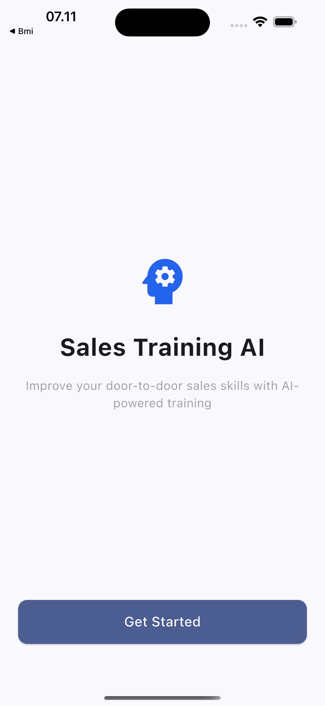
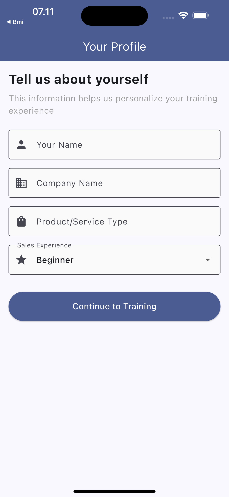
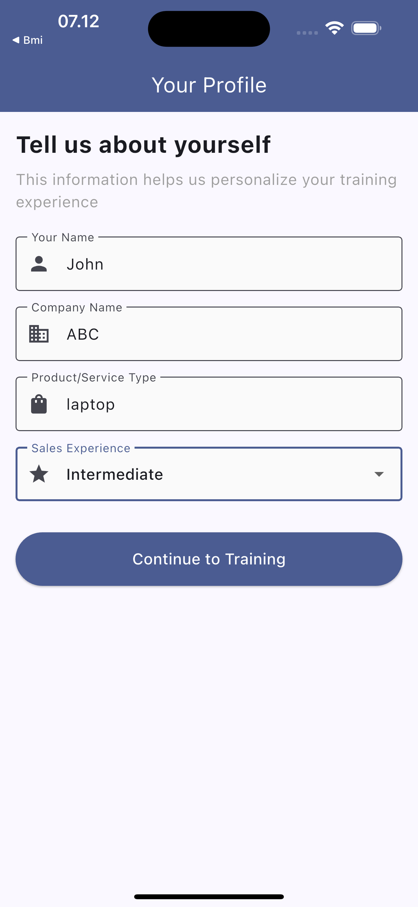
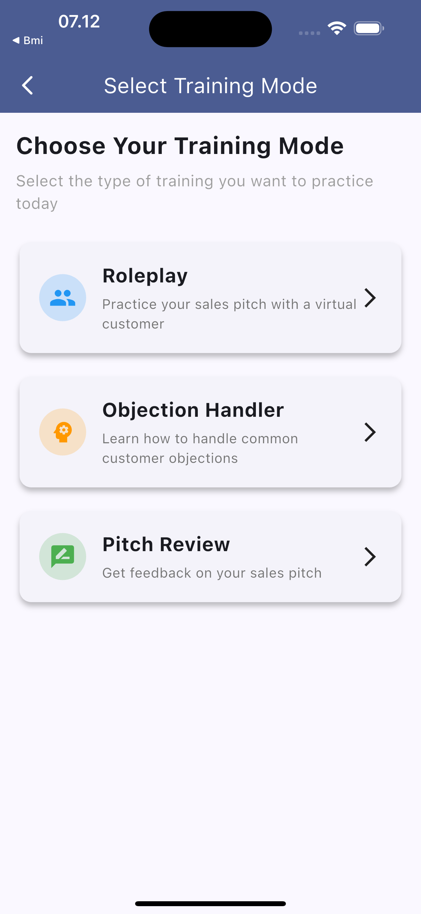
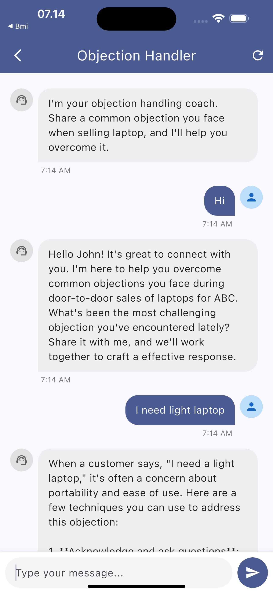
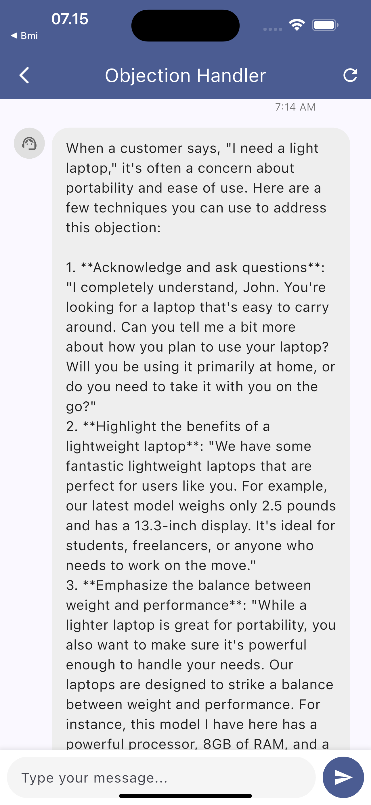
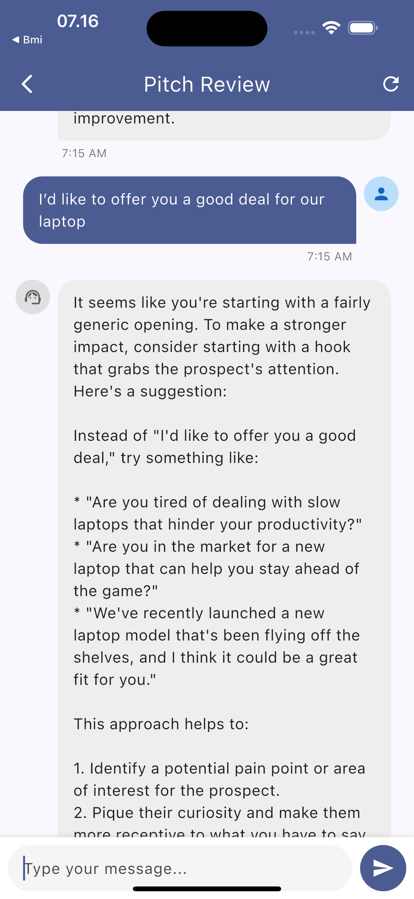

# Sales Training AI


A Flutter application designed to help sales professionals improve their door-to-door sales skills through AI-powered training scenarios.

## 📱 Features

- **Role-play Scenarios**: Practice your sales pitch with a virtual customer
- **Objection Handler**: Learn how to handle common customer objections
- **Pitch Review**: Get feedback on your sales pitch from AI
- **Personalized Experience**: Customize the training based on your product and experience level
- **Real-time AI Responses**: Powered by OpenRouter AI for natural conversations

## 🚀 Technologies

- Flutter & Dart
- Provider for state management
- OpenRouter API for AI capabilities
- Shared Preferences for local storage
- HTTP for API communication

## 📋 Requirements

- Flutter SDK 3.7.2 or higher
- Dart SDK 3.0.0 or higher
- OpenRouter API key

## 🔧 Setup & Installation

1. **Clone the repository**
   ```bash
   git clone https://github.com/dodyw/ai-sales-training.git
   cd sales_training_ai
   ```

2. **Install dependencies**
   ```bash
   flutter pub get
   ```

3. **Configure environment variables**
   Create a `.env` file in the root directory with the following:
   ```
   OPENROUTER_API_KEY=your_openrouter_api_key
   OPENROUTER_MODEL=meta-llama/llama-4-scout:free
   ```

4. **Run the app**
   ```bash
   flutter run
   ```

## 📱 App Structure

- `lib/models/` - Data models
- `lib/screens/` - UI screens
- `lib/services/` - Business logic and API services
- `lib/widgets/` - Reusable UI components

## 📸 Screenshots

<div align="center">
  
  
  
</div>

<div align="center">
  
  
  
</div>

<div align="center">
  
</div>

## 🔮 Future Enhancements

- Voice interaction capabilities
- More specialized training scenarios
- Performance analytics and progress tracking
- Team management features for sales managers

## 👨‍💻 Developer

**Dody Rachmat W**  
Website: [www.nicecoder.com](https://www.nicecoder.com)  
Email: [dody@gmail.com](mailto:dody@gmail.com)

Contact me to get help with custom mobile app development!

## 📄 License

This project is licensed under the MIT License - see the LICENSE file for details.
